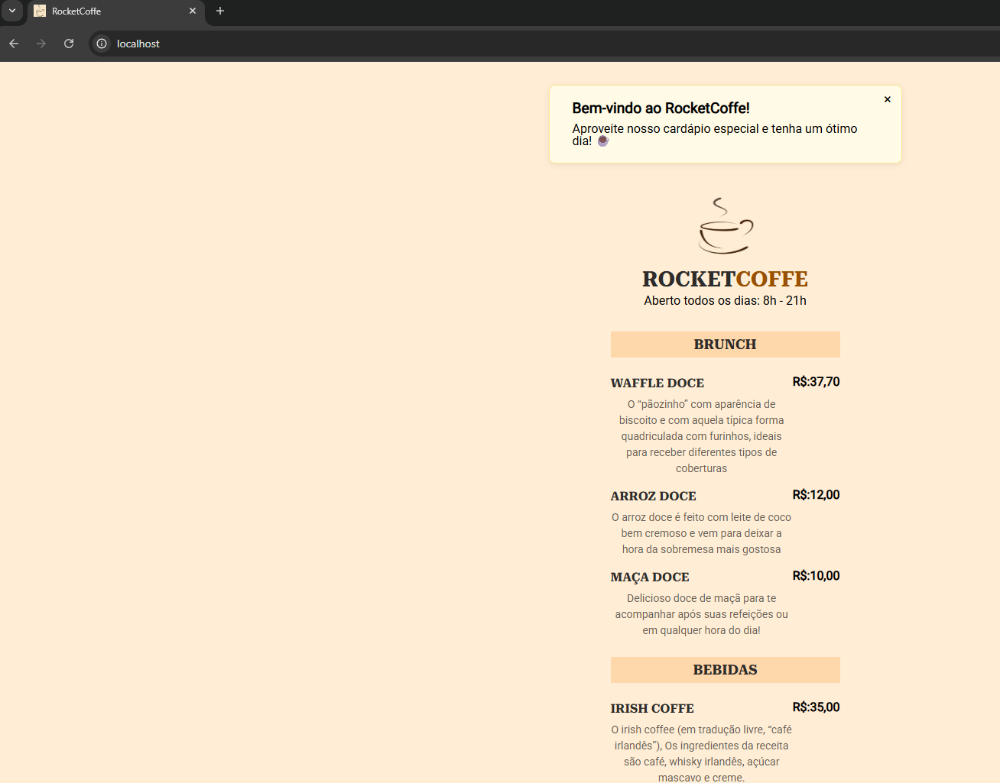

# DIO - Contêineres com Docker

## Solução do Desafio DIO

Este projeto foi desenvolvido como parte do desafio de docker da [DIO](https://dio.me), aplicando conceitos de Docker Compose para executar uma aplicação HTML em um Container Apache

## Introdução

Aplicação web simples de cardápio digital para uma cafeteria, desenvolvida com HTML, CSS e JavaScript, e servida via Apache em um ambiente Docker.

## Funcionalidades

- Exibição de cardápio de brunch e bebidas.
- Mensagem de boas-vindas estilizada ao acessar a página.

